# Lab1 Experiment Report

## task1 代码实现四种前导码检测

### 互相关检测前导码

```python
def normalized_complex_xcorr(arr, sub):
    arr = np.asarray(arr, dtype=np.complex128)
    sub = np.asarray(sub, dtype=np.complex128)
    N = len(arr)
    M = len(sub)
    ret_len = N - M + 1
    if ret_len <= 0:
        raise ValueError("sub is longer than arr")

    conj_sub = np.conj(sub)
    sub_norm = np.sqrt(np.sum(np.abs(sub) ** 2))  # sub的范数，固定值

    ret = np.zeros(ret_len, dtype=np.complex128)
    arr_norm = np.zeros(ret_len, dtype=np.float64)

    for i in range(ret_len):
        arr_slice = arr[i:i + M]
        ret[i] = np.sqrt(np.abs(np.sum(arr_slice * conj_sub)) ** 2)
        arr_norm[i] = np.sqrt(np.sum(np.abs(arr_slice) ** 2))

    denom = sub_norm * arr_norm
    denom[denom == 0] = 1e-15

    p_n = ret / denom
    return p_n


# Compare the correlation magnitude against this value to determine whether there is a preamble or not
def detect_preamble_cross_correlation(preamble, signal):
    m_n = normalized_complex_xcorr(signal, preamble)
    threshold = 0.9

    plt.figure(figsize=(10, 4))
    plt.plot(m_n.real, label='Cross-correlation coefficient')
    plt.axhline(y=threshold, color='r', linestyle='--', label='Threshold')
    plt.title('Cross-correlation Coefficient vs. Sample Index')
    plt.xlabel('Sample Index')
    plt.ylabel('Correlation Coefficient')
    plt.legend()
    plt.grid(True)
    plt.tight_layout()
    plt.show()

    for i, val in enumerate(m_n):
        if val > threshold:
            return i
    return None

```


### 自相关检测前导码

```python
def normalized_shifted_cross_correlation(sig, L):
    sig = np.asarray(sig)
    N = len(sig)
    result_len = N - 2 * L + 1

    if result_len <= 0:
        raise ValueError("Signal too short for given L")

    c = np.zeros(result_len, dtype=np.complex128)
    for i in range(result_len):
        x = sig[i:i + L]
        y = sig[i + L:i + 2 * L]
        numerator = np.sum(x * np.conj(y))
        denominator = np.sqrt(np.sum(np.abs(x) ** 2) * np.sum(np.abs(y) ** 2))
        c[i] = np.abs(numerator) / denominator if denominator != 0 else 0.0

    return c


def detect_preamble_auto_correlation(signal, short_preamble_len):
    c_n = normalized_shifted_cross_correlation(signal, short_preamble_len)
    threshold = 0.95

    plt.figure(figsize=(10, 4))
    plt.plot(np.abs(c_n), label='|c_n| (normalized correlation)', color='blue')
    plt.axhline(y=threshold, color='r', linestyle='--', label='Threshold')
    plt.title("Normalized Shifted Cross Correlation")
    plt.xlabel("Sample index")
    plt.ylabel("Normalized |c_n|")
    plt.grid(True)
    plt.legend()
    plt.tight_layout()
    plt.show()

    for i, val in enumerate(c_n):
        if val > threshold:
            return i
    return None

```

### 能量检测前导码
```python
def calc_energy(sig):
    return np.abs(sig) ** 2


def detect_preamble_by_energy(signal):
    energy = calc_energy(signal)
    energy_threshold = 1

    # 绘图
    plt.figure(figsize=(10, 4))
    plt.plot(energy, color='purple', label='|sig[i]|² (energy)')
    plt.axhline(y=energy_threshold, color='r', linestyle='--', label='Threshold')
    plt.title("Signal Energy per Sample")
    plt.xlabel("Sample index")
    plt.ylabel("Energy")
    plt.grid(True)
    plt.legend()
    plt.tight_layout()
    plt.show()

    for i, val in enumerate(energy):
        if val > energy_threshold:
            return i
    return None
```

### 双滑动窗口检测前导码

```python
def calc_energy(sig):
    return np.abs(sig) ** 2


def detect_preamble_by_sliding_window(signal, short_preamble_len):
    energy = calc_energy(signal)
    length = len(signal) - short_preamble_len + 1
    if length - short_preamble_len <= 0:
        print("signal too short")
        return None
    energy_window_sum = np.zeros(length)
    energy_window_sum[0] = sum(energy[0:short_preamble_len])
    for i in range(1, length):
        energy_window_sum[i] = energy_window_sum[i - 1] - energy[i - 1] + energy[i + short_preamble_len - 1]

    pa = energy_window_sum[0:length - short_preamble_len]
    pb = energy_window_sum[short_preamble_len:length]
    m = pb / pa
    max_value = np.max(m)
    max_index = np.argmax(m)

    threshold = 30

    # 画图
    plt.figure(figsize=(10, 4))
    plt.plot(m, label=f'Energy Window Sum (window size={short_preamble_len})')
    plt.axhline(y=threshold, color='r', linestyle='--', label='Threshold')
    plt.xlabel('Sample index')
    plt.ylabel('Energy sum')
    plt.title('Sliding Window Energy Sum')
    plt.grid(True)
    plt.legend()
    plt.tight_layout()
    plt.show()

    if max_value > threshold:
        return max_index + short_preamble_len

    return None

```

## task2 通过检测前导码确定信号数据中数据包的索引

**pluto接收信号的时域波形图**
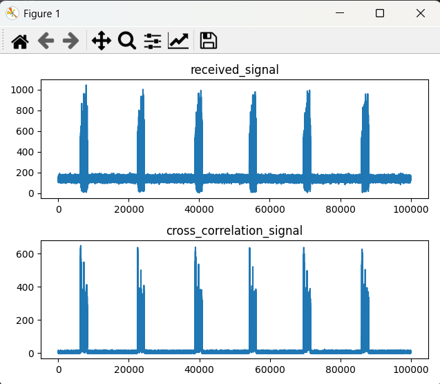

### 能量检测
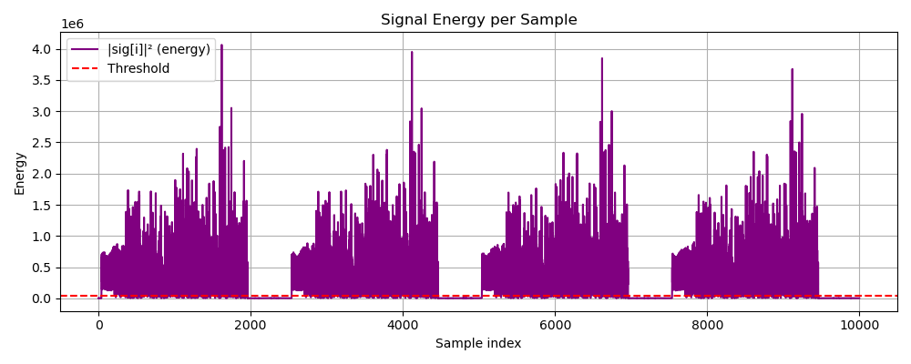
strong signal data_starts:[360, 2860, 5360, 7860]
strong signal psnr 22.47136793833487
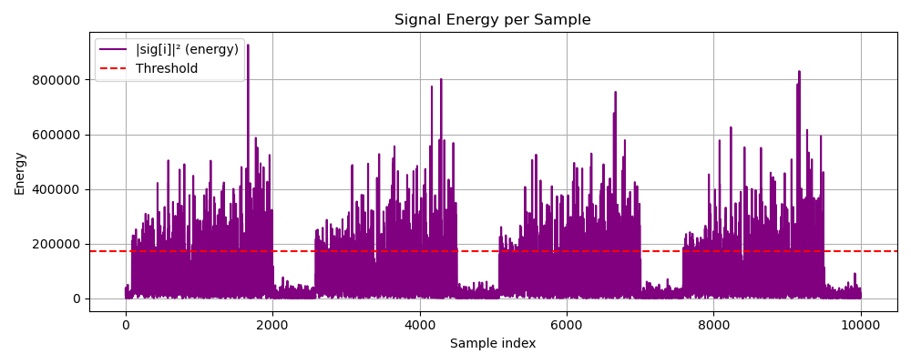
weak signal data_start:[414, 2909, 5414, 7914]
weak signal psnr 9.740379043482301

---

### 双滑动窗口检测
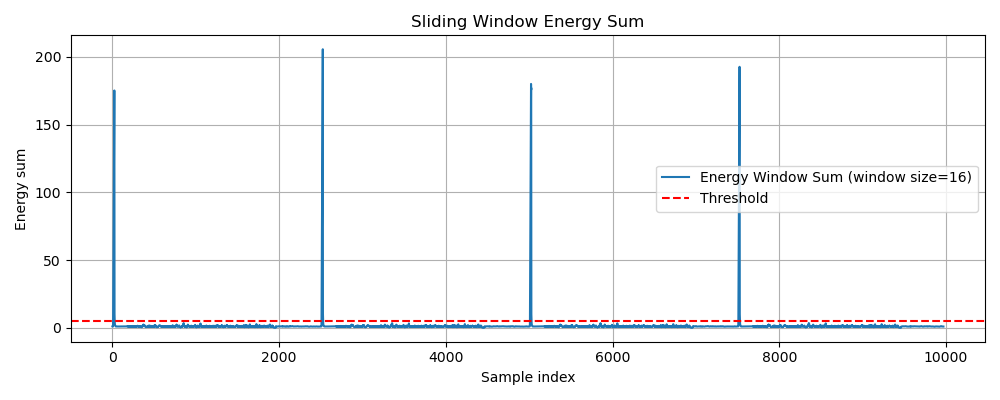
strong signal data_starts:[ 359 2859 5357 7858]

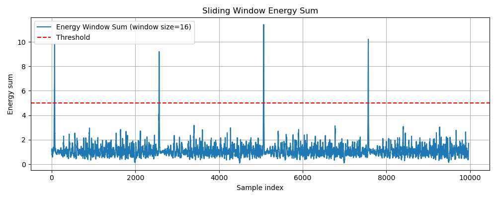
weak signal data_starts:[ 406 2905 5404 7904]

---

### 互相关检测

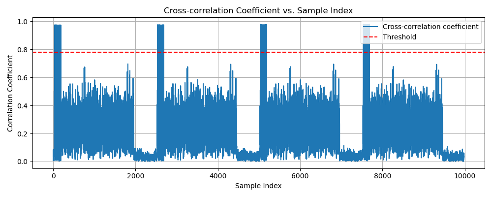
strong signal data starts calculated by preamble_sts:[ 359 2859 5359 7859]
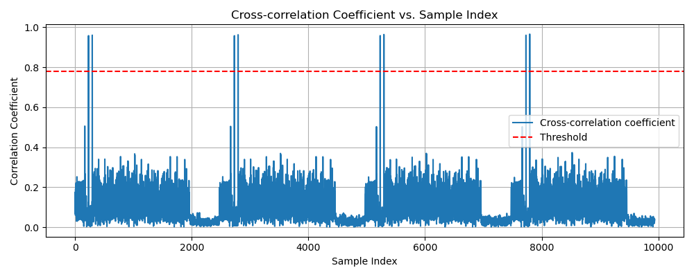
strong signal data starts calculated by preamble_lts:[ 359 2859 5359 7859]

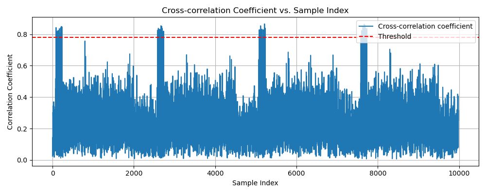
weak signal data starts calculated by preamble_sts:[ 406 2906 5406 7906]
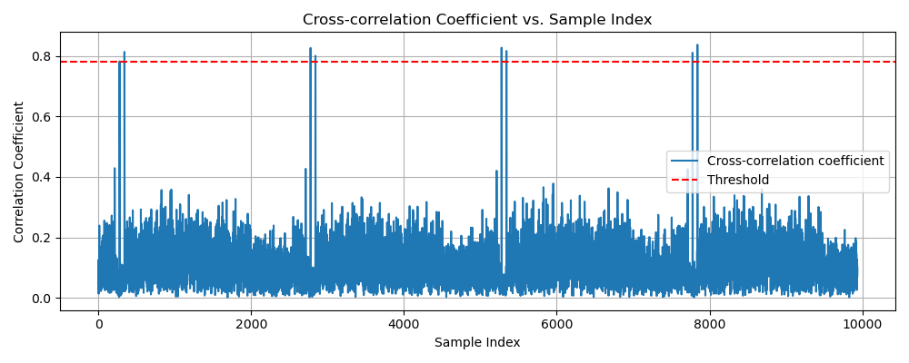
weak signal data starts calculated by preamble_lts:[ 406 2906 5406 7906]

---

### 自相关检测

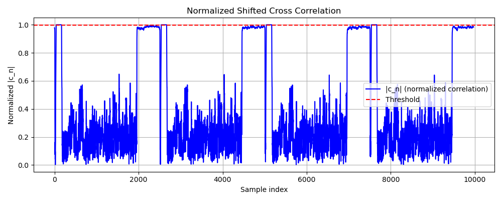
strong signal data starts calculated by preamble_sts:[ 359 2859 5359 7859]

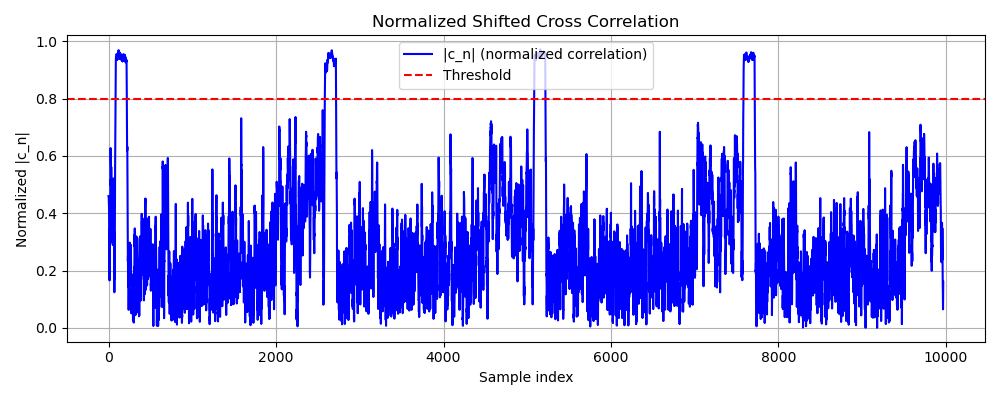
weak signal data starts calculated by preamble_sts:[ 404 2902 5402 7902]

---

## task3 通过pluto自己捕获信号并检索数据包

### 互相关检测

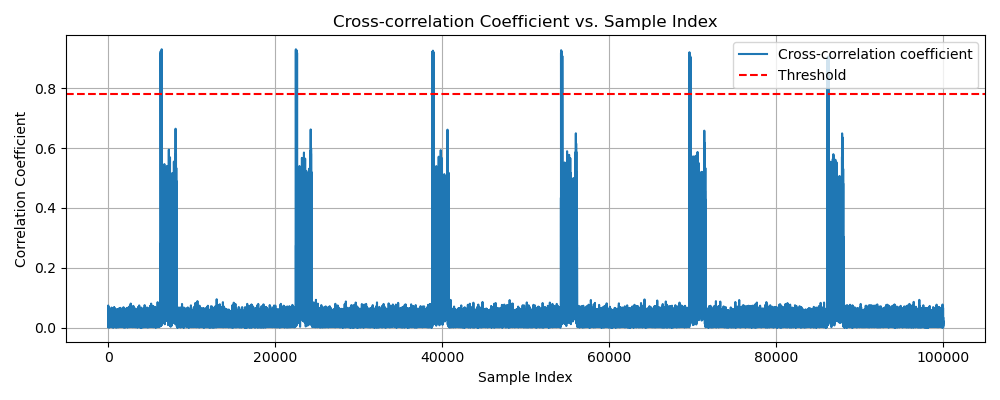
strong signal data starts calculated by preamble_sts:[ 6616 22794 39171 54539 69920 86420]

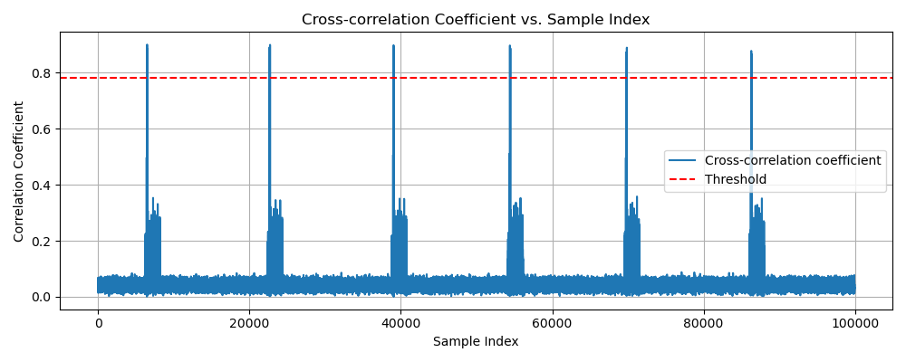
strong signal data starts calculated by preamble_lts:[ 6616 22794 39171 54539 69920 86420]

---

### 自相关检测

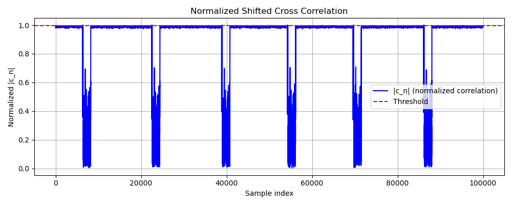
strong signal data starts calculated by preamble_sts:[ 6616 22801 39173 54543 69923 86431]

---

### 能量检测
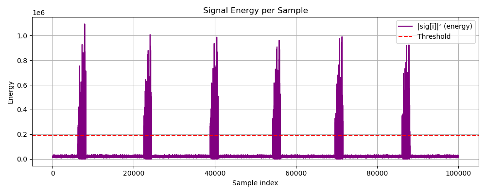
strong signal data_starts:[6620, 22798, 39175, 54543, 69924, 86424]
strong signal psnr 8.654814002591259

---

### 双滑动窗口检测
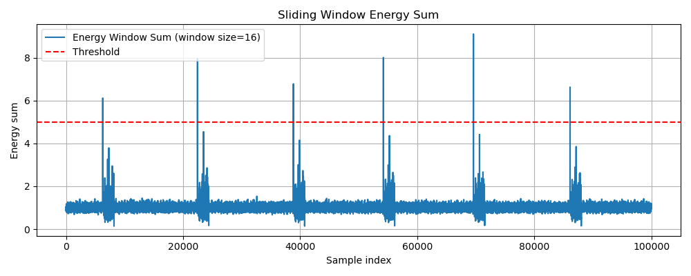
strong signal data_starts:[ 6616 22794 39171 54539 69920 86420]

---
