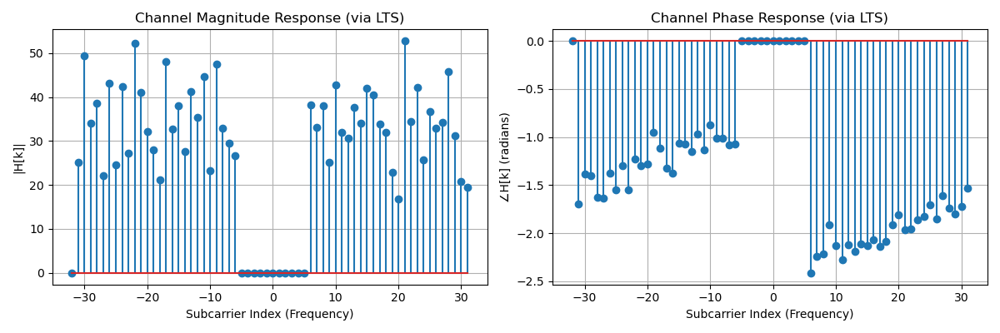
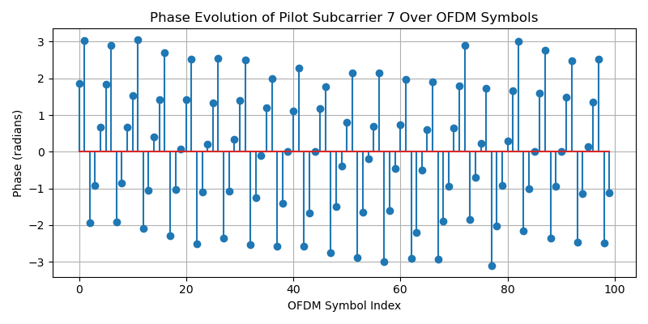
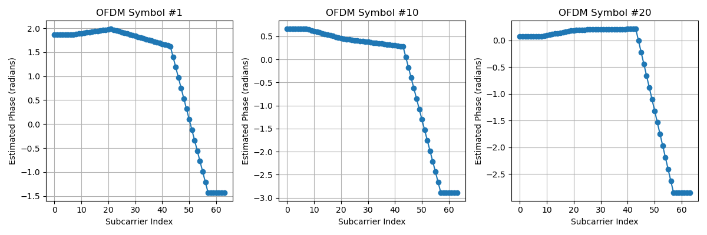
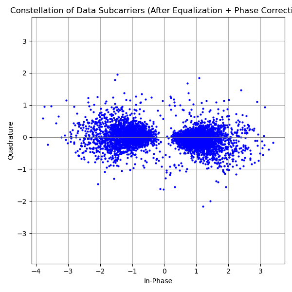
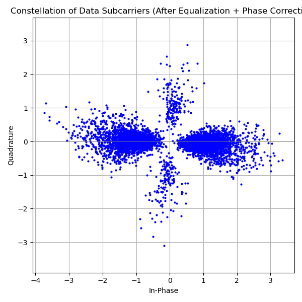
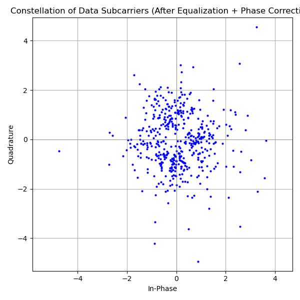
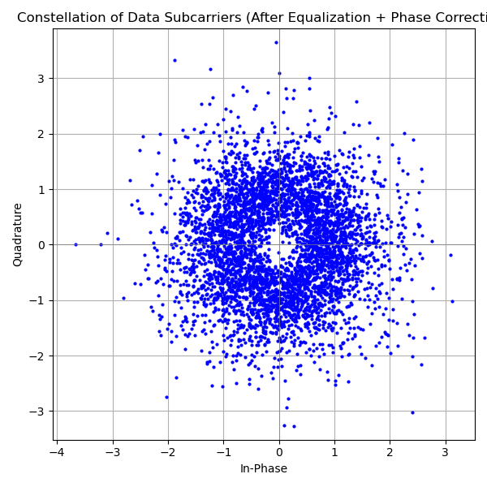
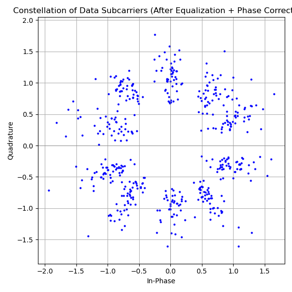
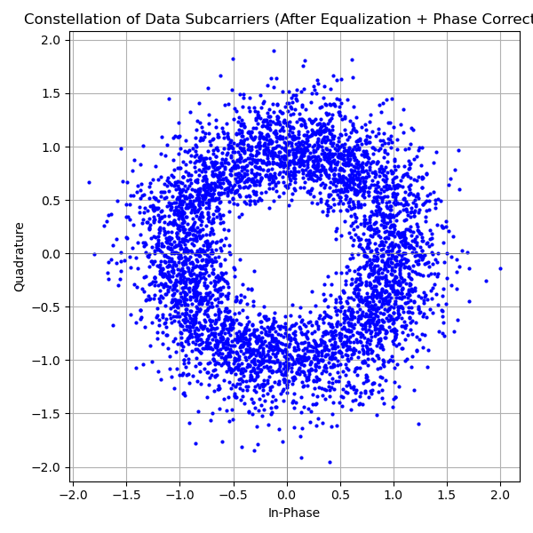

# Lab2 Experiment Report (OFDM)

## Part1 OFDM 信号解调

### task1.1 对tx_signal.npy 进行解调

```python
.....
# 4. BPSK 解调
demod_bits = (data_all.real > 0).astype(np.uint8)

# 读取原始数据
raw_data = np.load("./Lab2_data/raw_data.npy")

length = min(len(raw_data), len(demod_bits))
raw_data = raw_data[:length]
demod_bits = demod_bits[:length]

# 计算误码个数
num_errors = np.sum(raw_data != demod_bits)

# 计算误码率
ber = num_errors / length
```
**终端输出:**
```
比特长度: 960
错误比特数: 0
比特误码率 (BER): 0.000000
```

### task1.2 对接收数据进行解调

**终端输出:**
```
OFDM数据包起始位置:[39, 2539, 5039, 7539]
find ofdm data pack : 0
比特长度: 960
错误比特数: 12
比特误码率 (BER): 1.250000%
find ofdm data pack : 1
比特长度: 960
错误比特数: 12
比特误码率 (BER): 1.250000%
find ofdm data pack : 2
比特长度: 960
错误比特数: 25
比特误码率 (BER): 2.604167%
find ofdm data pack : 3
比特长度: 960
错误比特数: 9
比特误码率 (BER): 0.937500%
```

### task1.3 对未知数据的接收信号进行解调
全部的解调结果见10sym_data.npy 和 100sym_data.npy

**recorded_signal_10sym.npy**
**终端输出:**
```
data_pack_starts:[688, 1808, 2928, 4048, 5168, 6288, 7408 .........]
find ofdm data pack : 0
比特长度: 480
[0 0 1 1 0 0 1 1 1 0 1 1 0 0 0 0 1 1 1 0]
find ofdm data pack : 1
比特长度: 480
[0 0 1 1 0 0 1 1 1 0 1 1 0 0 0 0 1 1 1 0]
find ofdm data pack : 2
比特长度: 480
[0 0 1 1 0 0 1 1 1 0 1 1 0 0 0 0 1 1 1 0]
find ofdm data pack : 3
比特长度: 480
[0 0 1 1 0 0 1 1 1 0 1 1 0 0 0 0 1 1 1 0]
..............
```

**recorded_signal_100sym.npy**
**终端输出:**
```
data_pack_starts:[707, 9027, 17347, 25667, 33987, 42307, 50627, 58947, 67267, 75587, 83907, 92227]
find ofdm data pack : 0
比特长度: 4800
[0 1 0 0 1 1 1 1 1 0 0 1 0 0 1 0 0 1 1 0]
find ofdm data pack : 1
比特长度: 4800
[0 1 0 0 1 1 1 1 1 0 0 1 0 0 1 0 0 1 1 0]
find ofdm data pack : 2
比特长度: 4800
[0 1 0 0 1 1 1 1 1 0 0 1 0 0 1 0 0 1 1 0]
find ofdm data pack : 3
比特长度: 4800
[0 1 0 0 1 1 1 1 1 0 0 1 0 0 1 0 0 1 1 0]
.............
```

## Part2 OFDM信号解调方法的分析

### task2.1
由LTS提取出的信道特征如图,可以观察到有频率的选择性衰落



如图是一个导频子载波在一个数据包内所有OFDM符号的相位变化
相位呈现“周期性跳变”,表明存在累积的相位偏移,一定周期后相位超过𝜋,会跳到−𝜋，再逐渐上升
可以清晰看到，实际相位与理想导频偏离了很多



如图是第1个/第10个/第20个OFDM符号中, 使用导频绘制所有子载波相位的线性插值图
线性插值图展示了子载波之间的相位渐变特性
明显的斜率说明存在残留时间偏移或频偏
这类线性相位误差应该在解调前用导频插值进行补偿
后期符号相位更加稳定，说明 CFO/STO 补偿是有效的



如图是BPSK星座图:



### task2.2
仅在步骤5.2中估计残留CFO，绘制信道均衡后所有OFDM子载波的星座点



### task2.3
**recorded_signal_10sym.npy**
跳过步骤5.2-5.4,为recorded_signal_10sym.npy绘制信道均衡后所有OFDM子载波的星座点图  



**recorded_signal_100sym.npy**
跳过步骤5.2-5.4, 为recorded_signal_100sym.npy绘制信道均衡后所有OFDM子载波星座图



### task2.4
**recorded_signal_10sym.npy**
跳过步骤2和步骤5.2-5.4,为recorded_signal_10sym.npy绘制信道均衡后所有OFDM子载波的星座点图



**recorded_signal_100sym.npy**
跳过步骤2和步骤5.2-5.4, 为recorded_signal_100sym.npy绘制信道均衡后所有OFDM子载波星座图

